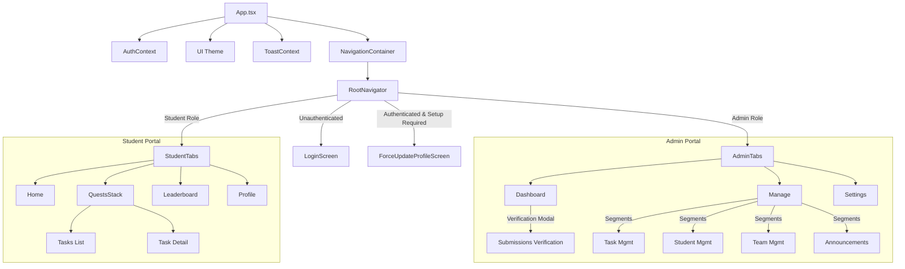

# Project Architecture & Dependency Graph

## 🗺️ High-Level Navigation & Auth Flow

## 🛠️ Service & Data Layer

```mermaid
graph LR
    subgraph UI_Layer [Screens & Components]
        S_Home[Home]
        S_Tasks[Tasks]
        S_AdminDash[Admin Dashboard]
        S_AdminManage[Admin Manage]
    end

    subgraph Logic_Layer [Hooks & Contexts]
        H_Auth[useAuth]
        H_User[useUser]
        C_Auth[AuthContext]
        C_Toast[ToastContext]
    end

    subgraph Data_Layer [Services]
        direction TB
        S_A[auth.ts]
        S_T[tasks.ts]
        S_U[users.ts]
        S_S[submissions.ts]
        S_TM[teams.ts]
        S_ST[settings.ts]
        S_N[notifications.ts]
        S_C[cloudinary.ts]
        S_FS[firestore.ts]
        S_UI[uploadImage.ts]
    end

    subgraph Infrastructure [Firebase]
        FB_A[Authentication]
        FB_FS[Firestore]
        FB_ST[Storage]
        FB_CF[Cloud Functions]
    end

    UI_Layer --> Logic_Layer
    Logic_Layer --> Data_Layer
    Data_Layer --> Infrastructure
    Infrastructure --> FB_CF
```

## 📁 Directory Structure Overview
- **`src/`**: Primary application source.
    - **`components/`**: Reusable UI elements (Buttons, Cards, Modals, Skeletons).
    - **`contexts/`**: React Context providers for Auth and Toasts.
    - **`hooks/`**: Custom hooks for business logic and data fetching.
    - **`navigation/`**: Stack and Tab navigation configurations.
    - **`screens/`**: Feature-specific views divided by `Admin/` and `Student/`.
    - **`services/`**: Firebase API wrappers, business logic, and external integrations (Cloudinary).
    - **`theme/`**: Design tokens (colors, spacing, typography).
    - **`types/`**: TypeScript interfaces and types.
    - **`utils/`**: Helper functions and constants.
- **`functions/`**: Firebase Cloud Functions (TypeScript).
- **`scripts/`**: Utility scripts for data migration and seeding.
- **`assets/`**: Static images and icons.
